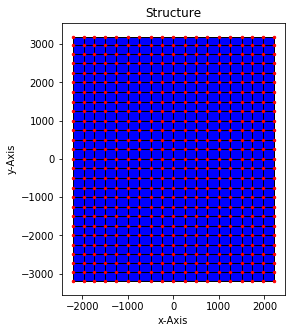

## CORE BASE EXAMPLE 01

The will model a 600thk Slab of Grade 32MPa, 4.4m x 6.4m supported on a foundation material with a 
bearing capacity of 200kPa/mm. There will be tension only supports at the nodes:

| x mm        | y mm        |
| ----------- | ----------- |
| -1500.0     | -2500.0     |
|  1500.0     | -2500.0     |
| -1500.0     |  2500.0     |
|  1500.0     |  2500.0     |

### LOAD CASES

| Case        | Case Type |
| ----------- | ------ |
| 'DL'        | 'DEAD' |
| 'SDL'       | 'OTHER DEAD' |
| 'LL'        | 'LIVE' |
| 'LLRED'     | 'LIVE REDUCIBLE' |
| 'EQX1'      | 'STATIC EQ X 1' |
| 'EQY1'      | 'STATIC EQ Y 2' |

### LOAD COMBINATIONS

| Case        | Load Cases and Factors                                 |
| ----------- | ------------------------------------------------------ |
| max service | ['DL', 1.0], ['SDL', 1.0], ['LL', 1.0], ['LLRED', 1.0] |
| service     | ['DL', 1.0], ['SDL', 1.0], ['LL', 0.7], ['LLRED', 0.7] |
| longterm    | ['DL', 1.0], ['SDL', 1.0], ['LL', 0.4], ['LLRED', 0.4] |
| strength    | ['DL', 0.9], ['SDL', 0.9]                              |
| strength    | ['DL', 0.9], ['SDL', 0.9], ['LL', 1.5], ['LLRED', 1.5] |
| strength    | ['DL', 1.35], ['SDL', 1.35]                            |
| strength    | ['DL', 1.2], ['SDL', 1.2], ['LL', 1.5], ['LLRED', 1.5] |
| strength    | ['DL', 1.0], ['SDL', 1.0], ['LL', 0.3], ['LLRED', 0.3], ['EQX1', 1.0], ['EQY1', 0.3] |
| strength    | ['DL', 1.0], ['SDL', 1.0], ['LL', 0.3], ['LLRED', 0.3], ['EQX1', 1.0], ['EQY1', -0.3] |
| strength    | ['DL', 1.0], ['SDL', 1.0], ['LL', 0.3], ['LLRED', 0.3], ['EQX1', -1.0], ['EQY1', 0.3] |
| strength    | ['DL', 1.0], ['SDL', 1.0], ['LL', 0.3], ['LLRED', 0.3], ['EQX1', -1.0], ['EQY1', -0.3] |
| strength    | ['DL', 1.0], ['SDL', 1.0], ['LL', 0.3], ['LLRED', 0.3], ['EQX1', 0.3], ['EQY1', 1.0] |
| strength    | ['DL', 1.0], ['SDL', 1.0], ['LL', 0.3], ['LLRED', 0.3], ['EQX1', 0.3], ['EQY1', -1.0] |
| strength    | ['DL', 1.0], ['SDL', 1.0], ['LL', 0.3], ['LLRED', 0.3], ['EQX1', -0.3], ['EQY1', 1.0] |
| strength    | ['DL', 1.0], ['SDL', 1.0], ['LL', 0.3], ['LLRED', 0.3], ['EQX1', -0.3], ['EQY1', -1.0] |
